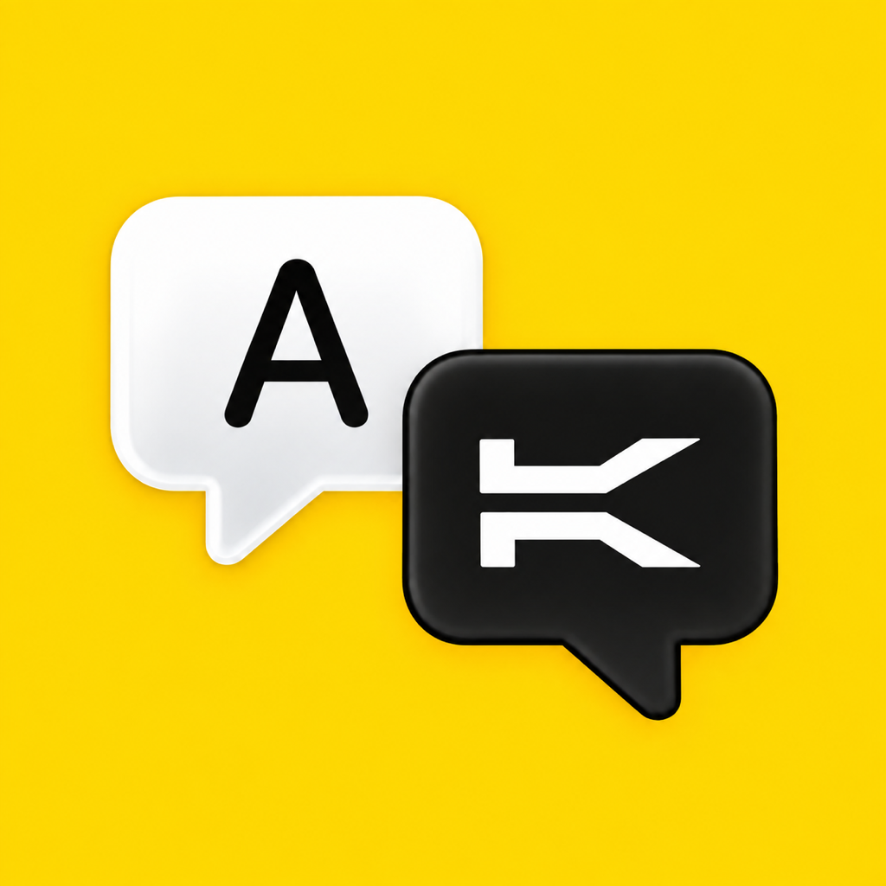

  

<h1 align="center">Holonet</h1>

Holonet is a Safari Web Extension that displays webpage text in Aurebesh on iPhone, iPad, and Mac. It changes the page's typeface without rewriting its words, and you can switch back to the original appearance at any time.

  

## Features

- Works in Safari on iPhone, iPad, and Mac.
- Includes Standard and Digraphs reading modes.
- Uses fonts bundled with the app.
- Keeps settings on your device.
- Collects no browsing history, webpage content, or personal data.

## Requirements

- iOS or iPadOS 17 or later, or macOS 14 or later.
- Safari with the Holonet extension enabled.

## Getting started

After installing Holonet, open the app for platform-specific setup instructions. Enable the extension in Safari's extension settings, grant access only to the websites where you want to use it, then open Holonet from Safari's Page menu or toolbar to choose a reading mode.

## About this repository

This repository contains the public Holonet website hosted with GitHub Pages. It describes and supports the app, but does not contain the SwiftUI app or Safari extension source code.

- [Website](https://zacharyfarnes.github.io/Holonet/)
- [Support](https://zacharyfarnes.github.io/Holonet/support.html)
- [Privacy Policy](https://zacharyfarnes.github.io/Holonet/privacy.html)

Holonet is an independent, unofficial app and is not affiliated with or endorsed by Lucasfilm, Disney, or their affiliates.
